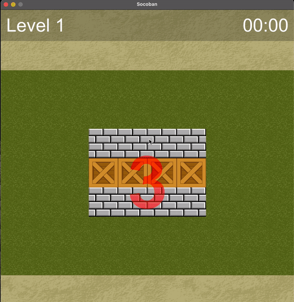

# Socoban

Inspired by a classic Sokoban game. Game has multiple levels. At the beginning of each level you will be shown a board
wil boxes for 3 seconds. Then boxes will be spread across the board randomly. Your task is to move the boxes to turn the
board to its initial state. You have to manage to complete it before timer hits 0.



## Controls

Use arrow keys or:

- w - move up
- s - move left
- a - move down
- d - move right
- e - see target board

**To push or pull a box hold SHIFT key and use controls.**

## Levels

Levels are customizable. You can add new levels by creating files inside `src/level/`.

File name should be `level-N.txt` format, for ex. `level-1.txt`, `level-2.txt`.

```
10 5 60
----------
---====---
---####---
---====---
----------
```

1st line of file is level info. Consists of 3 columns:

1. Map width
2. Map height
3. Time limit in seconds

The rest of the file is the representaion of the level board map:

- `-` Empty spot
- `#` Box
- `=` Wall
